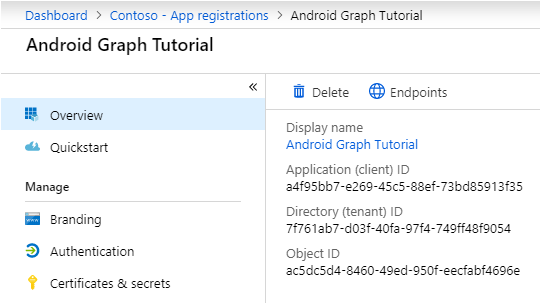

# 如何运行已完成的项目How to run the completed project

## 先决条件Prerequisites

若要在此文件夹中运行已完成的项目, 您需要以下各项:To run the completed project in this folder, you need the following:

- 安装在开发计算机上的[Android Studio](https://developer.android.com/studio/) 。[Android Studio](https://developer.android.com/studio/) installed on your development machine. (**注意:** 本教程是使用 android Studio 版本3.3.1 在 1.8.0 JRE 和 ANDROID 9.0 SDK 中编写的。(**Note:** This tutorial was written with Android Studio version 3.3.1 with the 1.8.0 JRE and the Android 9.0 SDK. 本指南中的步骤可能适用于其他版本, 但尚未经过测试。The steps in this guide may work with other versions, but that has not been tested.)
- 使用 Outlook.com 上的邮箱的个人 Microsoft 帐户, 或者是 Microsoft 工作或学校帐户。Either a personal Microsoft account with a mailbox on Outlook.com, or a Microsoft work or school account.

如果你没有 Microsoft 帐户, 可以使用以下几种方法获取免费帐户:If you don't have a Microsoft account, there are a couple of options to get a free account:

- 你可以[注册新的个人 Microsoft 帐户](https://signup.live.com/signup?wa=wsignin1.0&rpsnv=12&ct=1454618383&rver=6.4.6456.0&wp=MBI_SSL_SHARED&wreply=https://mail.live.com/default.aspx&id=64855&cbcxt=mai&bk=1454618383&uiflavor=web&uaid=b213a65b4fdc484382b6622b3ecaa547&mkt=E-US&lc=1033&lic=1)。You can [sign up for a new personal Microsoft account](https://signup.live.com/signup?wa=wsignin1.0&rpsnv=12&ct=1454618383&rver=6.4.6456.0&wp=MBI_SSL_SHARED&wreply=https://mail.live.com/default.aspx&id=64855&cbcxt=mai&bk=1454618383&uiflavor=web&uaid=b213a65b4fdc484382b6622b3ecaa547&mkt=E-US&lc=1033&lic=1).
- 你可以[注册 office 365 开发人员计划](https://developer.microsoft.com/office/dev-program)以获取免费的 office 365 订阅。You can [sign up for the Office 365 Developer Program](https://developer.microsoft.com/office/dev-program) to get a free Office 365 subscription.

## 在 Azure 门户中注册应用程序Register an application with the Azure Portal

1. 打开浏览器，并转到 [Azure Active Directory 管理中心](https://aad.portal.azure.com)。然后，使用**个人帐户**（亦称为“Microsoft 帐户”）或**工作或学校帐户**登录。Open a browser and navigate to the [Azure Active Directory admin center](https://aad.portal.azure.com) and login using a **personal account** (aka: Microsoft Account) or **Work or School Account**.

1. 在左侧导航栏中选择 " **Azure Active Directory** ", 然后选择 "**管理**" 下的 "**应用程序注册**"。Select **Azure Active Directory** in the left-hand navigation, then select **App registrations** under **Manage**.

    

1. 选择“新注册”\*\*\*\*。Select **New registration**. 在“注册应用”\*\*\*\* 页上，按如下方式设置值。On the **Register an application** page, set the values as follows.

    - 将“名称”\*\*\*\* 设置为“`Android Graph Tutorial`”。Set **Name** to `Android Graph Tutorial`.
    - 将“受支持的帐户类型”\*\*\*\* 设置为“任何组织目录中的帐户和个人 Microsoft 帐户”\*\*\*\*。Set **Supported account types** to **Accounts in any organizational directory and personal Microsoft accounts**.
    - 保留“重定向 URI”\*\*\*\* 为空。Leave **Redirect URI** empty.

    

1. 选择“注册”\*\*\*\*。Choose **Register**. 在 " **Xamarin Graph 教程**" 页上, 复制**应用程序 (客户端) ID**的值并保存它, 下一步将需要它。On the **Xamarin Graph Tutorial** page, copy the value of the **Application (client) ID** and save it, you will need it in the next step.

    

1. 选择 "**添加重定向 URI** " 链接。Select the **Add a Redirect URI** link. 在 "**重定向 uri** " 页上, 找到 "**公共客户端 (移动、桌面)** " 部分的 "建议的重定向 uri" 部分。On the **Redirect URIs** page, locate the **Suggested Redirect URIs for public clients (mobile, desktop)** section. 选择以开头`msal`和复制的 URI, 然后选择 "**保存**"。Select the URI that begins with `msal` and copy it, then choose **Save**. 保存复制的重定向 URI, 在下一步中将需要它。Save the copied redirect URI, you will need it in the next step.

    

## 运行示例Run the sample

在 Android Studio 中, 选择 "**运行**" 菜单上的 **"运行 ' 应用程序 '"** 。In Android Studio, choose **Run 'app'** on the **Run** menu.