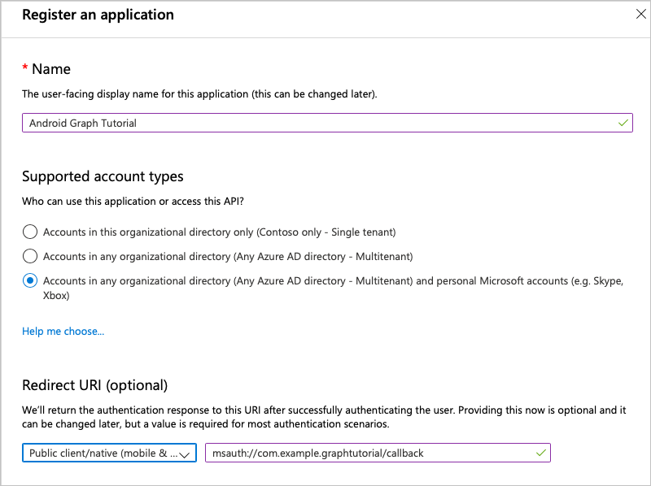

# 如何运行已完成的项目

## 先决条件

若要在此文件夹中运行已完成的项目，您需要以下各项：

- 安装在开发计算机上的[Android Studio](https://developer.android.com/studio/) 。 （**注意：** 本教程是使用 android Studio 版本3.3.1 在 1.8.0 JRE 和 ANDROID 9.0 SDK 中编写的。 本指南中的步骤可能适用于其他版本，但尚未经过测试。
- 使用 Outlook.com 上的邮箱的个人 Microsoft 帐户，或者是 Microsoft 工作或学校帐户。

如果你没有 Microsoft 帐户，可以使用以下几种方法获取免费帐户：

- 你可以[注册新的个人 Microsoft 帐户](https://signup.live.com/signup?wa=wsignin1.0&rpsnv=12&ct=1454618383&rver=6.4.6456.0&wp=MBI_SSL_SHARED&wreply=https://mail.live.com/default.aspx&id=64855&cbcxt=mai&bk=1454618383&uiflavor=web&uaid=b213a65b4fdc484382b6622b3ecaa547&mkt=E-US&lc=1033&lic=1)。
- 你可以[注册 office 365 开发人员计划](https://developer.microsoft.com/office/dev-program)以获取免费的 office 365 订阅。

## 在 Azure 门户中注册应用程序

1. 打开浏览器，并转到 [Azure Active Directory 管理中心](https://aad.portal.azure.com)。然后，使用**个人帐户**（亦称为“Microsoft 帐户”）或**工作或学校帐户**登录。

1. 在左侧导航栏中选择 " **Azure Active Directory** "，然后选择 "**管理**" 下的 "**应用程序注册**"。

    

1. 选择“新注册”****。 在“注册应用”**** 页上，按如下方式设置值。

    - 将“名称”**** 设置为“`Android Graph Tutorial`”。
    - 将“受支持的帐户类型”**** 设置为“任何组织目录中的帐户和个人 Microsoft 帐户”****。
    - 保留“重定向 URI”**** 为空。

    

1. 选择 "**注册**"。 在 " **Xamarin Graph 教程**" 页上，复制**应用程序（客户端） ID**的值并保存它，下一步将需要它。

    

1. 选择 "**添加重定向 URI** " 链接。 在 "**重定向 uri** " 页上，找到 "**公共客户端（移动、桌面）** " 部分的 "建议的重定向 uri" 部分。 选择以开头`msal`和复制的 URI，然后选择 "**保存**"。 保存复制的重定向 URI，在下一步中将需要它。

    

## 配置示例

1. 将`oauth_strings.xml.example`文件重命名`oauth_strings.xml`为，并将文件移动`GraphTutorial/app/src/main/res/values`到目录中。
1. 编辑`oauth_strings.xml`文件并进行以下更改。
    1. 将`YOUR_APP_ID_HERE`替换为你从 Azure 门户获取的**应用程序 Id** 。

## 运行示例

在 Android Studio 中，选择 "**运行**" 菜单上的 **"运行 ' 应用程序 '"** 。
