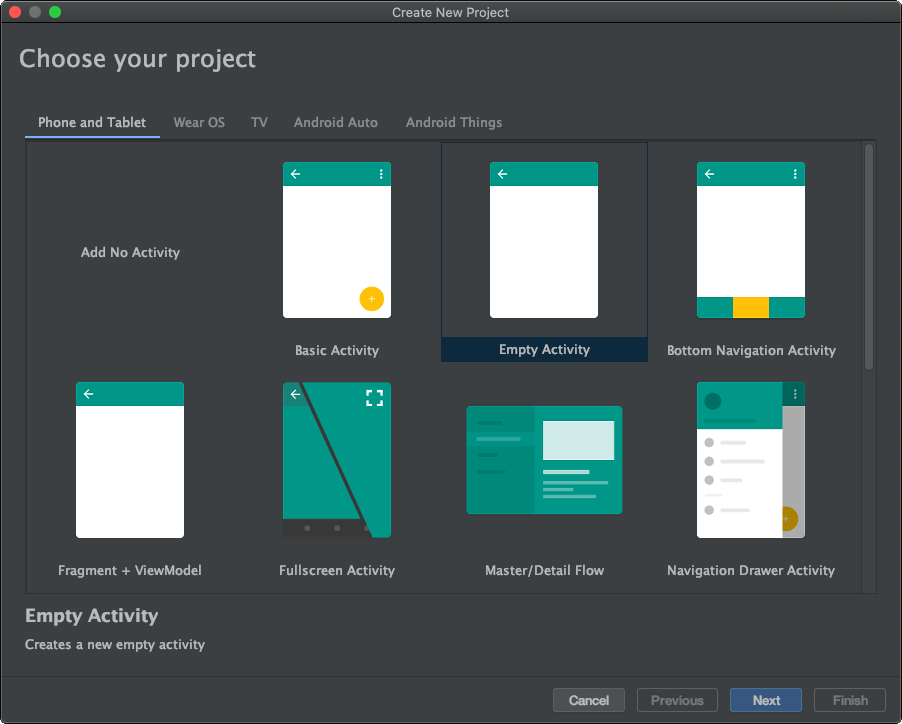
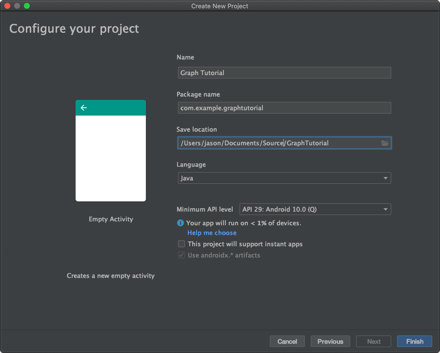
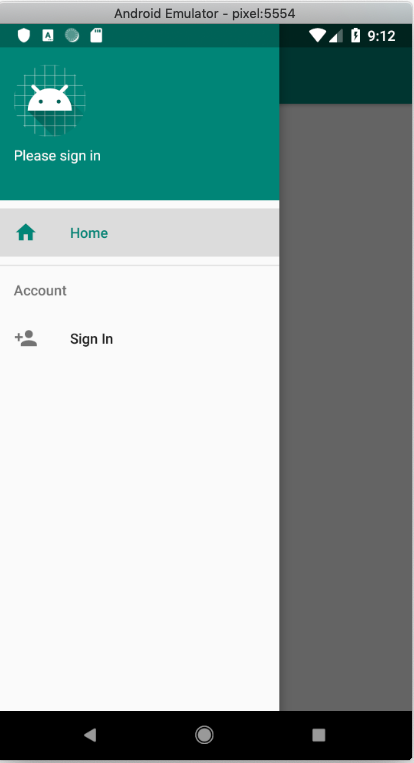

<!-- markdownlint-disable MD002 MD041 -->

打开 Android studio, 并在欢迎屏幕上选择 "**启动新的 Android studio 项目**"。 在 "**新建项目**" 对话框中, 选择 "**空活动**", 然后选择 "**下一步**"。



在 "**配置项目**" 对话框中, 将**** "名称`Graph Tutorial`" 设置为, 确保 "**语言**" `Java`字段设置为, 并确保将 "**最小 API" 级别**设置为`API 27: Android 8.1 (Oreo)`。 根据需要修改**包名称**和**保存位置**。 选择“完成”****。



> [!IMPORTANT]
> 确保为在这些实验室说明中指定的项目输入完全相同的名称。 项目名称将成为代码中的命名空间的一部分。 这些指令中的代码取决于与这些说明中指定的项目名称匹配的命名空间。 如果使用其他项目名称, 则代码将不会编译, 除非您调整所有命名空间以匹配您在创建项目时输入的项目名称。

在继续之前, 请安装稍后将使用的一些其他依赖项。

- `com.android.support:design`使导航抽屉布局对应用程序可用。
- [适用于 Android 的 Microsoft 身份验证库 (MSAL)](https://github.com/AzureAD/microsoft-authentication-library-for-android)来处理 Azure AD 身份验证和令牌管理。
- [microsoft graph SDK for Java](https://github.com/microsoftgraph/msgraph-sdk-java) , 用于调用 microsoft graph。

展开 " **Gradle 脚本**", 然后打开 " **Gradle" (Module: app)** 文件。 在`dependencies`值中添加以下行。

```Gradle
implementation 'com.android.support:design:28.0.0'
implementation 'com.microsoft.graph:microsoft-graph:1.1.+'
implementation 'com.microsoft.identity.client:msal:0.2.+'
```

> [!NOTE]
> 如果使用的是不同的 SDK 版本, 请务必将更改`28.0.0`为与**gradle**中已存在的`com.android.support:appcompat-v7`依赖项版本相匹配。

在`packagingOptions` **gradle (Module: app)** 文件中的值的`android`内部添加一个。

```Gradle
packagingOptions {
    pickFirst 'META-INF/jersey-module-version'
}
```

保存所做的更改。 在 "**文件**" 菜单上, 选择 "**使用 Gradle 文件同步项目**"。

## <a name="design-the-app"></a>设计应用程序

应用程序将使用[导航抽屉](https://developer.android.com/training/implementing-navigation/nav-drawer)在不同视图之间导航。 在此步骤中, 将更新活动以使用导航抽屉版式, 并为视图添加片段。

### <a name="create-a-navigation-drawer"></a>创建导航抽屉

首先, 创建应用程序的导航菜单图标。 右键单击 " **app/res/可以绘制**" 文件夹, 然后选择 "**新建**", 然后选择 "**矢量资产**"。 单击 "**剪贴画**" 旁边的 "图标" 按钮。 在 "**选择图标**" 窗口中`home` , 键入搜索栏, 然后选择 "**主页**" 图标, 然后选择 **"确定"**。 将**名称**更改为`ic_menu_home`。


依次选择 "**下一步**" 和 "**完成**"。 重复此步骤, 创建两个以上的图标。

- 名称: `ic_menu_calendar`, 图标:`event`
- 名称: `ic_menu_signout`, 图标:`exit to app`
- 名称: `ic_menu_signin`, 图标:`person add`

接下来, 创建一个用于应用程序的菜单。 右键单击 " **res** " 文件夹, 然后依次选择 "**新建**"、" **Android 资源目录**"。 将**资源类型**更改为`menu` , 然后选择 **"确定"**。

右键单击新的**菜单**文件夹, 然后选择 "**新建**", 然后选择 "**菜单资源文件**"。 命名该文件`drawer_menu` , 然后选择 **"确定"**。 打开文件时, 选择 "**文本**" 选项卡以查看 XML, 然后将整个内容替换为以下内容。

```xml
<?xml version="1.0" encoding="utf-8"?>
<menu xmlns:android="http://schemas.android.com/apk/res/android"
    xmlns:tools="http://schemas.android.com/tools"
    tools:showIn="navigation_view">

    <group android:checkableBehavior="single">
        <item
            android:id="@+id/nav_home"
            android:icon="@drawable/ic_menu_home"
            android:title="Home" />

        <item
            android:id="@+id/nav_calendar"
            android:icon="@drawable/ic_menu_calendar"
            android:title="Calendar" />
    </group>

    <item android:title="Account">
        <menu>
            <item
                android:id="@+id/nav_signin"
                android:icon="@drawable/ic_menu_signin"
                android:title="Sign In" />

            <item
                android:id="@+id/nav_signout"
                android:icon="@drawable/ic_menu_signout"
                android:title="Sign Out" />
        </menu>
    </item>

</menu>
```

现在, 更新应用程序的主题, 使其与导航抽屉兼容。 打开 " **app/res/values/styles** " 文件。 替换`Theme.AppCompat.Light.DarkActionBar`为`Theme.AppCompat.Light.NoActionBar`。 然后在`style`元素内添加以下行。

```xml
<item name="windowActionBar">false</item>
<item name="windowNoTitle">true</item>
<item name="android:statusBarColor">@android:color/transparent</item>
```

接下来, 为菜单创建一个标头。 右键单击 "**应用程序/分辨率/布局**" 文件夹。 依次选择 "**新建**"、"**布局资源文件**"。 命名文件`nav_header`并将**根元素**更改为`LinearLayout`。 选择"确定"。

打开**nav_header**文件并选择 "**文本**" 选项卡。将整个内容替换为以下内容。

```xml
<?xml version="1.0" encoding="utf-8"?>
<<?xml version="1.0" encoding="utf-8"?>
<LinearLayout xmlns:android="http://schemas.android.com/apk/res/android"
    android:layout_width="match_parent"
    android:layout_height="176dp"
    android:background="@color/colorPrimary"
    android:gravity="bottom"
    android:orientation="vertical"
    android:padding="16dp"
    android:theme="@style/ThemeOverlay.AppCompat.Dark">

    <ImageView
        android:id="@+id/user_profile_pic"
        android:layout_width="wrap_content"
        android:layout_height="wrap_content"
        android:src="@mipmap/ic_launcher" />

    <TextView
        android:id="@+id/user_name"
        android:layout_width="wrap_content"
        android:layout_height="wrap_content"
        android:paddingTop="8dp"
        android:text="Test User"
        android:textAppearance="@style/TextAppearance.AppCompat.Body1" />

    <TextView
        android:id="@+id/user_email"
        android:layout_width="wrap_content"
        android:layout_height="wrap_content"
        android:text="test@contoso.com" />

</LinearLayout>
```

现在, 打开**app/res/layout/activity_main**文件。 `DrawerLayout`通过将现有 XML 替换为以下项, 将布局更新为。

```xml
<?xml version="1.0" encoding="utf-8"?>
<android.support.v4.widget.DrawerLayout xmlns:android="http://schemas.android.com/apk/res/android"
    xmlns:app="http://schemas.android.com/apk/res-auto"
    xmlns:tools="http://schemas.android.com/tools"
    android:id="@+id/drawer_layout"
    android:layout_width="match_parent"
    android:layout_height="match_parent"
    android:fitsSystemWindows="true"
    tools:context=".MainActivity"
    tools:openDrawer="start">

    <RelativeLayout
        android:layout_width="match_parent"
        android:layout_height="match_parent"
        android:orientation="vertical">

        <ProgressBar
            android:id="@+id/progressbar"
            android:layout_width="75dp"
            android:layout_height="75dp"
            android:layout_centerInParent="true"
            android:visibility="gone"/>

        <android.support.v7.widget.Toolbar
            android:id="@+id/toolbar"
            android:layout_width="match_parent"
            android:layout_height="?attr/actionBarSize"
            android:background="@color/colorPrimary"
            android:elevation="4dp"
            android:theme="@style/ThemeOverlay.AppCompat.Dark.ActionBar" />

        <FrameLayout
            android:id="@+id/fragment_container"
            android:layout_width="match_parent"
            android:layout_height="match_parent"
            android:layout_below="@+id/toolbar" />
    </RelativeLayout>

    <android.support.design.widget.NavigationView
        android:id="@+id/nav_view"
        android:layout_width="wrap_content"
        android:layout_height="match_parent"
        android:layout_gravity="start"
        app:headerLayout="@layout/nav_header"
        app:menu="@menu/drawer_menu" />

</android.support.v4.widget.DrawerLayout>
```

接下来, 打开**应用程序/res/values/strings**。 在`resources`元素中添加以下元素。

```xml
<string name="navigation_drawer_open">Open navigation drawer</string>
<string name="navigation_drawer_close">Close navigation drawer</string>
```

最后, 打开**app/java/com 示例/graphtutorial/MainActivity**文件。 将整个内容替换为以下内容。

```java
package com.example.graphtutorial;

import android.support.annotation.NonNull;
import android.support.design.widget.NavigationView;
import android.support.v4.view.GravityCompat;
import android.support.v4.widget.DrawerLayout;
import android.support.v7.app.ActionBarDrawerToggle;
import android.support.v7.app.AppCompatActivity;
import android.os.Bundle;
import android.support.v7.widget.Toolbar;
import android.view.Menu;
import android.view.MenuItem;
import android.view.View;
import android.widget.TextView;

public class MainActivity extends AppCompatActivity implements NavigationView.OnNavigationItemSelectedListener {
    private DrawerLayout mDrawer;
    private NavigationView mNavigationView;
    private View mHeaderView;
    private boolean mIsSignedIn = false;
    private String mUserName = null;
    private String mUserEmail = null;

    @Override
    protected void onCreate(Bundle savedInstanceState) {
        super.onCreate(savedInstanceState);
        setContentView(R.layout.activity_main);

        // Set the toolbar
        Toolbar toolbar = findViewById(R.id.toolbar);
        setSupportActionBar(toolbar);

        mDrawer = findViewById(R.id.drawer_layout);

        // Add the hamburger menu icon
        ActionBarDrawerToggle toggle = new ActionBarDrawerToggle(this, mDrawer, toolbar,
                R.string.navigation_drawer_open, R.string.navigation_drawer_close);
        mDrawer.addDrawerListener(toggle);
        toggle.syncState();

        mNavigationView = findViewById(R.id.nav_view);

        // Set user name and email
        mHeaderView = mNavigationView.getHeaderView(0);
        setSignedInState(mIsSignedIn);

        // Listen for item select events on menu
        mNavigationView.setNavigationItemSelectedListener(this);
    }

    @Override
    public boolean onNavigationItemSelected(@NonNull MenuItem menuItem) {
        // TEMPORARY
        return false;
    }

    @Override
    public void onBackPressed() {
        if (mDrawer.isDrawerOpen(GravityCompat.START)) {
            mDrawer.closeDrawer(GravityCompat.START);
        } else {
            super.onBackPressed();
        }
    }

    public void showProgressBar()
    {
        FrameLayout container = findViewById(R.id.fragment_container);
        ProgressBar progressBar = findViewById(R.id.progressbar);
        container.setVisibility(View.GONE);
        progressBar.setVisibility(View.VISIBLE);
    }

    public void hideProgressBar()
    {
        FrameLayout container = findViewById(R.id.fragment_container);
        ProgressBar progressBar = findViewById(R.id.progressbar);
        progressBar.setVisibility(View.GONE);
        container.setVisibility(View.VISIBLE);
    }

    // Update the menu and get the user's name and email
    private void setSignedInState(boolean isSignedIn) {
        mIsSignedIn = isSignedIn;

        Menu menu = mNavigationView.getMenu();

        // Hide/show the Sign in, Calendar, and Sign Out buttons
        menu.findItem(R.id.nav_signin).setVisible(!isSignedIn);
        menu.findItem(R.id.nav_calendar).setVisible(isSignedIn);
        menu.findItem(R.id.nav_signout).setVisible(isSignedIn);

        // Set the user name and email in the nav drawer
        TextView userName = mHeaderView.findViewById(R.id.user_name);
        TextView userEmail = mHeaderView.findViewById(R.id.user_email);

        if (isSignedIn) {
            // For testing
            mUserName = "Megan Bowen";
            mUserEmail = "meganb@contoso.com";

            userName.setText(mUserName);
            userEmail.setText(mUserEmail);
        } else {
            mUserName = null;
            mUserEmail = null;

            userName.setText("Please sign in");
            userEmail.setText("");
        }
    }
}
```

### <a name="add-fragments"></a>添加片段

右键单击 "**应用/res/布局**" 文件夹, 然后选择 "**新建**", 然后选择 "**布局资源文件**"。 命名文件`fragment_home`并将**根元素**更改为`RelativeLayout`。 选择"确定"。

打开 " **fragment_home** " 文件, 并将其内容替换为以下内容。

```xml
<?xml version="1.0" encoding="utf-8"?>
<RelativeLayout xmlns:android="http://schemas.android.com/apk/res/android"
    android:layout_width="match_parent"
    android:layout_height="match_parent">

    <LinearLayout
        android:layout_width="wrap_content"
        android:layout_height="wrap_content"
        android:layout_centerInParent="true"
        android:orientation="vertical">

        <TextView
            android:layout_width="wrap_content"
            android:layout_height="wrap_content"
            android:layout_gravity="center_horizontal"
            android:text="Welcome!"
            android:textSize="30sp" />

        <TextView
            android:id="@+id/home_page_username"
            android:layout_width="wrap_content"
            android:layout_height="wrap_content"
            android:layout_gravity="center_horizontal"
            android:paddingTop="8dp"
            android:text="Please sign in"
            android:textSize="20sp" />
    </LinearLayout>

</RelativeLayout>
```

接下来, 右键单击 "**应用/res/布局**" 文件夹, 然后选择 "**新建**", 然后选择 "**布局资源文件**"。 命名文件`fragment_calendar`并将**根元素**更改为`RelativeLayout`。 选择"确定"。

打开 " **fragment_calendar** " 文件, 并将其内容替换为以下内容。

```xml
<?xml version="1.0" encoding="utf-8"?>
<RelativeLayout xmlns:android="http://schemas.android.com/apk/res/android"
    android:layout_width="match_parent"
    android:layout_height="match_parent">

    <TextView
        android:layout_width="wrap_content"
        android:layout_height="wrap_content"
        android:layout_centerInParent="true"
        android:text="Calendar"
        android:textSize="30sp" />

</RelativeLayout>
```

现在, 右键单击 " **app/java/graphtutorial** " 文件夹, 然后依次选择 "**新建**"、" **java 类**"。 命名该类`HomeFragment`并将**超类**设置为`android.support.v4.app.Fragment`。 选择"确定"。 打开 " **HomeFragment** " 文件, 并将其内容替换为以下内容。

```java
package com.example.graphtutorial;

import android.os.Bundle;
import android.support.annotation.NonNull;
import android.support.annotation.Nullable;
import android.support.v4.app.Fragment;
import android.view.LayoutInflater;
import android.view.View;
import android.view.ViewGroup;
import android.widget.TextView;

public class HomeFragment extends Fragment {
    private static final String USER_NAME = "userName";

    private String mUserName;

    public HomeFragment() {

    }

    public static HomeFragment createInstance(String userName) {
        HomeFragment fragment = new HomeFragment();

        // Add the provided username to the fragment's arguments
        Bundle args = new Bundle();
        args.putString(USER_NAME, userName);
        fragment.setArguments(args);
        return fragment;
    }

    @Override
    public void onCreate(@Nullable Bundle savedInstanceState) {
        super.onCreate(savedInstanceState);
        if (getArguments() != null) {
            mUserName = getArguments().getString(USER_NAME);
        }
    }

    @Nullable
    @Override
    public View onCreateView(@NonNull LayoutInflater inflater, @Nullable ViewGroup container, @Nullable Bundle savedInstanceState) {
        View homeView = inflater.inflate(R.layout.fragment_home, container, false);

        // If there is a username, replace the "Please sign in" with the username
        if (mUserName != null) {
            TextView userName = homeView.findViewById(R.id.home_page_username);
            userName.setText(mUserName);
        }

        return homeView;
    }
}
```

接下来, 右键单击 " **app/java/.com" graphtutorial**文件夹, 然后依次选择 "**新建**"、" **java 类**"。 命名该类`CalendarFragment`并将**超类**设置为`android.support.v4.app.Fragment`。 选择"确定"。

打开 " **CalendarFragment** " 文件, 并将以下函数添加`CalendarFragment`到类中。

```java
@Nullable
@Override
public View onCreateView(@NonNull LayoutInflater inflater, @Nullable ViewGroup container, @Nullable Bundle savedInstanceState) {
    return inflater.inflate(R.layout.fragment_calendar, container, false);
}
```

现在已实现片段, 更新`MainActivity`类以处理`onNavigationItemSelected`事件并使用片段。 首先, 将以下函数添加到类中。

```java
// Load the "Home" fragment
public void openHomeFragment(String userName) {
    HomeFragment fragment = HomeFragment.createInstance(userName);
    getSupportFragmentManager().beginTransaction()
            .replace(R.id.fragment_container, fragment)
            .commit();
    mNavigationView.setCheckedItem(R.id.nav_home);
}

// Load the "Calendar" fragment
private void openCalendarFragment() {
    getSupportFragmentManager().beginTransaction()
            .replace(R.id.fragment_container, new CalendarFragment())
            .commit();
    mNavigationView.setCheckedItem(R.id.nav_calendar);
}

private void signIn() {
    setSignedInState(true);
    openHomeFragment(mUserName);
}

private void signOut() {
    setSignedInState(false);
    openHomeFragment(mUserName);
}
```

接下来, 将现有`onNavigationItemSelected`函数替换为以下函数。

```java
@Override
public boolean onNavigationItemSelected(@NonNull MenuItem menuItem) {
    // Load the fragment that corresponds to the selected item
    switch (menuItem.getItemId()) {
        case R.id.nav_home:
            openHomeFragment(mUserName);
            break;
        case R.id.nav_calendar:
            openCalendarFragment();
            break;
        case R.id.nav_signin:
            signIn();
            break;
        case R.id.nav_signout:
            signOut();
            break;
    }

    mDrawer.closeDrawer(GravityCompat.START);

    return true;
}
```

最后, 在`onCreate`函数末尾添加以下内容, 以在应用程序启动时加载主片段。

```java
// Load the home fragment by default on startup
if (savedInstanceState == null) {
    openHomeFragment(mUserName);
}
```

保存所有更改。 在 "**运行**" 菜单上, 选择 **"运行 ' 应用 '"**。 在点击 "登录" 或 "注销 **"** 按钮时, 应用的菜单应工作在两个片段**** 之间导航并发生变化。

