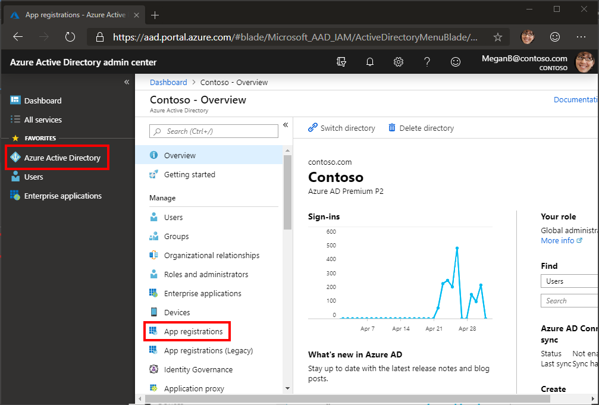

<!-- markdownlint-disable MD002 MD041 -->

在本练习中, 你将使用 azure Active Directory 管理中心创建新的 azure AD native 应用程序。In this exercise you will create a new Azure AD native application using the Azure Active Directory admin center.

1. 打开浏览器，并转到 [Azure Active Directory 管理中心](https://aad.portal.azure.com)。然后，使用**个人帐户**（亦称为“Microsoft 帐户”）或**工作或学校帐户**登录。Open a browser and navigate to the [Azure Active Directory admin center](https://aad.portal.azure.com) and login using a **personal account** (aka: Microsoft Account) or **Work or School Account**.

1. 选择左侧导航栏中的“Azure Active Directory”\*\*\*\*，再选择“管理”\*\*\*\* 下的“应用注册(预览版)”\*\*\*\*。Select **Azure Active Directory** in the left-hand navigation, then select **App registrations (Preview)** under **Manage**.

    

1. 选择“新注册”\*\*\*\*。Select **New registration**. 在“注册应用”\*\*\*\* 页上，按如下方式设置值。On the **Register an application** page, set the values as follows.

    - 将“名称”\*\*\*\* 设置为“`Android Graph Tutorial`”。Set **Name** to `Android Graph Tutorial`.
    - 将“受支持的帐户类型”\*\*\*\* 设置为“任何组织目录中的帐户和个人 Microsoft 帐户”\*\*\*\*。Set **Supported account types** to **Accounts in any organizational directory and personal Microsoft accounts**.
    - 保留“重定向 URI”\*\*\*\* 为空。Leave **Redirect URI** empty.

    

1. 选择“注册”\*\*\*\*。Choose **Register**. 在 " **Android Graph 教程**" 页上, 复制**应用程序 (客户端) ID**的值并保存它, 下一步将需要它。On the **Android Graph Tutorial** page, copy the value of the **Application (client) ID** and save it, you will need it in the next step.

    

1. 选择 "**添加重定向 URI** " 链接。Select the **Add a Redirect URI** link. 在 "**重定向 uri** " 页上, 找到 "**公共客户端 (移动、桌面)** " 部分的 "建议的重定向 uri" 部分。On the **Redirect URIs** page, locate the **Suggested Redirect URIs for public clients (mobile, desktop)** section. 选择以开头`msal`和复制的 URI, 然后选择 "**保存**"。Select the URI that begins with `msal` and copy it, then choose **Save**. 保存复制的重定向 URI, 在下一步中将需要它。Save the copied redirect URI, you will need it in the next step.

    